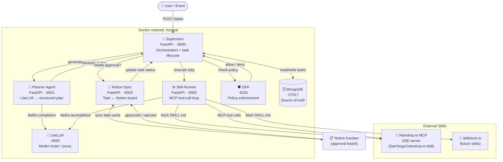

# home-ai-control-plane

A **policy-governed, multi-agent AI control plane** running on a single Raspberry Pi 5. It manages personal digital workflows, home-lab services, and smart-home integrations — with OPA-enforced approvals, budget limits, and a skill-based execution model.

The generic framework layer now lives in the separate [Conductor-Engine](https://github.com/DanSega1/Conductor-Engine) repository. This repo is the application layer that consumes that framework.

---

## Architecture



---

## Services

| Service | Port | Role |
|---|---|---|
| `supervisor` | 8000 | Task lifecycle orchestration, OPA enforcement, approval gating |
| `planner` | 8001 | Converts natural language goals into structured `Plan` objects via LiteLLM |
| `skill-runner` | 8002 | Executes plan steps using SKILL.md + MCP tool-call loop |
| `notion-sync` | 8003 | Mirrors task state to/from a Notion Kanban board |
| `litellm` | 4000 | Model router — swap providers without touching service code |
| `opa` | 8181 | Policy engine — validates task execution, skill access, budget |
| `mongo` | 27017 | Persistent task + event store |

---

## Repository Structure

```
home-ai-control-plane/
├── agents/
│   └── planner/            # Planner agent (FastAPI)
├── config/
│   ├── litellm_config.yaml
│   └── .env.*.example      # per-service env templates
├── constraints.txt          # pinned Python package versions (monorepo-wide)
├── contracts/
│   ├── task.py             # shared Task / Plan pydantic models
│   └── model_usage.py      # LLM usage tracking schema
├── docs/
│   └── ...
├── infra/
│   └── docker-compose.yml
├── policies/
│   └── homeai/
│       ├── budget/budget.rego   # token / cost limits
│       ├── skill/skill.rego     # per-skill permission gates
│       └── task/task.rego       # allow/deny task execution
├── services/
│   ├── supervisor/         # Orchestration engine (FastAPI)
│   ├── skill-runner/       # MCP-based skill executor (FastAPI)
│   └── notion-sync/        # Notion board sync (FastAPI)
└── skills/
    ├── registry.yaml        # installed skills + source pointers
    └── raindrop-io/
        └── skill.ref.yaml  # local metadata; SKILL.md fetched at runtime
```

---

## Skills Model

Skills are **not** Python code in this repo. Each skill lives in its own repository and is loaded at runtime:

1. `skills/registry.yaml` declares installed skills — source type (`github`, `skillstore`, `local`), MCP server URL, auth env, and risk level.
2. On startup, `skill-runner` fetches the skill's `SKILL.md` from GitHub / skillstore.io and caches it locally.
3. At execution time, `SKILL.md` becomes the LLM system prompt; the MCP server exposes tools; `skill-runner` drives the tool-call loop.

**Currently installed:**

| Skill | Source | MCP type | Risk |
|---|---|---|---|
| `raindrop-io` | [DanSega1/raindrop-io-skill](https://github.com/DanSega1/raindrop-io-skill) `v1.0.0` | SSE | low / high (delete) |

To add a skill, append an entry to `skills/registry.yaml` — no code changes required.

---

## Getting Started

### Conductor Engine

This repo consumes the published framework package from PyPI rather than tracking the generic `engine/` code directly:

```bash
python3.14 -m pip install conductor-engine==0.6.0
```

Conductor Engine currently provides the generic framework layer for:

- capability loading and plugin registration
- built-in runtime capabilities (`echo`, `filesystem`, `http`, plus optional `memory`)
- task supervision, retries, and local task persistence
- the `cond` CLI (`run`, `capability list`, `task list`, `workflow run`)
- workflow contracts and the `WorkflowOrchestrator`

See [docs/conductor-engine.md](docs/conductor-engine.md) for a researched summary of the engine repo, capability surface, and how this app uses it.

### Prerequisites
- Python 3.14
- Docker + Docker Compose
- A running [Raindrop.io MCP server](https://github.com/DanSega1/raindrop-io-skill) (or another skill's MCP server)

### 1. Configure env files

```bash
cp config/.env.litellm.example    config/.env.litellm
cp config/.env.supervisor.example config/.env.supervisor
cp config/.env.planner.example    config/.env.planner
cp config/.env.skill-runner.example config/.env.skill-runner
cp config/.env.notion-sync.example config/.env.notion-sync
```

Fill in API keys and tokens in each `.env` file. The critical ones:

| File | Key | Purpose |
|---|---|---|
| `.env.litellm` | `OPENAI_API_KEY` (or other) | LLM provider |
| `.env.skill-runner` | `RAINDROP_MCP_TOKEN` | Bearer token for Raindrop MCP server |
| `.env.notion-sync` | `NOTION_TOKEN`, `NOTION_DATABASE_ID` | Notion integration |

### 2. Start the stack

```bash
cd infra
docker compose up --build
```

### 3. Create and execute a task

```bash
# Create
curl -X POST http://localhost:8000/tasks \
  -H 'Content-Type: application/json' \
  -d '{"goal": "Save https://example.com to my research collection in Raindrop"}'

# Approve (or approve in Notion)
curl -X POST http://localhost:8000/tasks/{task_id}/approve

# Execute
curl -X POST http://localhost:8000/tasks/{task_id}/execute
```

---

## Policies

OPA enforces three policy files at `policies/`:

| Policy | What it controls |
|---|---|
| `homeai/task/task.rego` | Allowed task states, iteration caps, pause/deny logic |
| `homeai/budget/budget.rego` | Per-task and daily token / cost limits |
| `homeai/skill/skill.rego` | Which skills are allowed and at what risk level |

Policies are hot-reloaded — edit a `.rego` file and OPA picks up the change without restarting.

---

## Testing & Tooling

### Run tests

```bash
pip install -r requirements-test.txt
pytest
```

Tests live in `tests/` and mirror the source package structure:

| Test module | What it covers |
|---|---|
| `tests/contracts/test_task.py` | `Task`, `ExecutionPlan`, `ExecutionStep`, enums, request/response models |
| `tests/contracts/test_model_usage.py` | `ModelUsageRecord`, `BudgetStatus` |
| `tests/supervisor/test_opa_client.py` | OPA REST wrapper — allow/deny/fail-closed behaviour |
| `tests/supervisor/test_task_service.py` | Task lifecycle, budget guard, OPA gates |

### Pre-commit hooks

Installed automatically on first `git commit` after:

```bash
pip install pre-commit   # or: brew install pre-commit
pre-commit install
pre-commit install --hook-type commit-msg
```

| Hook | What it enforces |
|---|---|
| `ruff` | Python linting (auto-fix) |
| `ruff-format` | Python formatting |
| `pytest` | Contract tests must pass before every commit |
| `conventional-pre-commit` | Commit messages must follow [Conventional Commits](https://www.conventionalcommits.org/) |

**Valid commit types:** `feat`, `fix`, `docs`, `style`, `refactor`, `perf`, `test`, `build`, `ci`, `chore`, `revert`

```bash
# ✅ valid
git commit -m "feat(supervisor): add retry logic for OPA timeouts"
git commit -m "fix(budget): handle zero-token edge case"
git commit -m "chore: bump OPA to v1.14.0"

# ❌ rejected
git commit -m "updated stuff"
```

---

## Phases

| Phase | Status | Focus |
|---|---|---|
| **Phase 1** | ✅ In progress | MVP — task lifecycle, OPA, one skill, Notion approval |
| Phase 2 | planned | Multi-agent routing, risk scoring, Agent Guild |
| Phase 3 | planned | Home-lab control (Docker, backups, monitoring) |
| Phase 4 | planned | Hardening, observability, alerting |

---

## Dependency Management

All Python services share a single [`constraints.txt`](constraints.txt) at the project root. Each service's `requirements.txt` lists only package names (no versions); Docker build installs with:

```dockerfile
RUN pip install --no-cache-dir -c constraints.txt -r requirements.txt
```

To upgrade a package, edit `constraints.txt` once — all services pick it up on next build.
